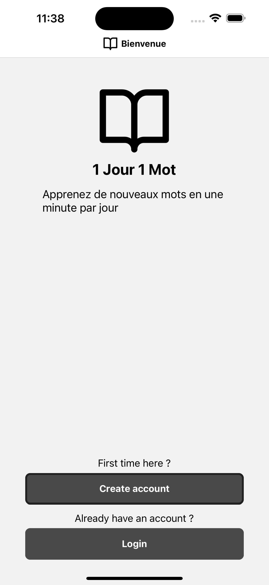
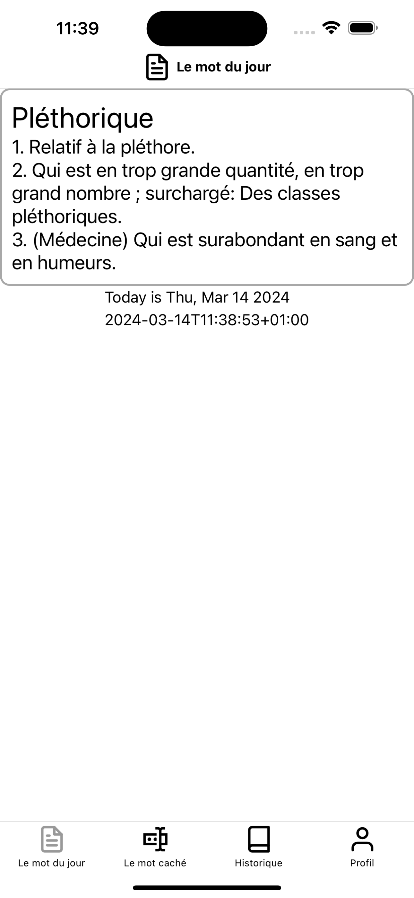
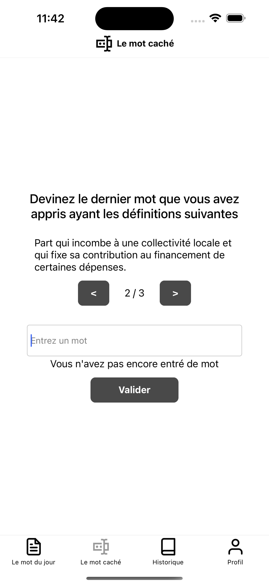
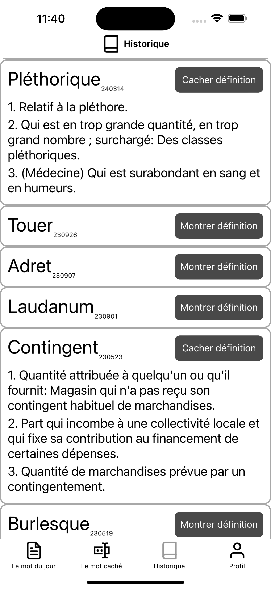

# 1jour-1mot-app

## Description

"1 jour 1 mot" est une application mobile qui aide les utilisateurs à apprendre un nouveau mot chaque jour. L'application est construite avec React Native et utilise Firebase pour l'authentification et le stockage des données.

## Fonctionnalités

L'utilisateur peut se connecter ou créer un compte.
L'utilisateur peut apprendre le mot du jour.
L'utilisateur peut deviner le dernier mot affiché.

## Installation

Pour installer et exécuter le projet, suivez les étapes suivantes:

- Clonez le dépôt.
- Installez les dépendances avec npm install.
- Démarrez le projet avec npm start.

Vous pouvez ensuite utiliser l'émulateur Android ou iOS pour exécuter l'application.
Vous pouvez également utiliser l'application Expo sur votre téléphone pour scanner le QR code.

## Images (design temporaire)

  
   
  
  

